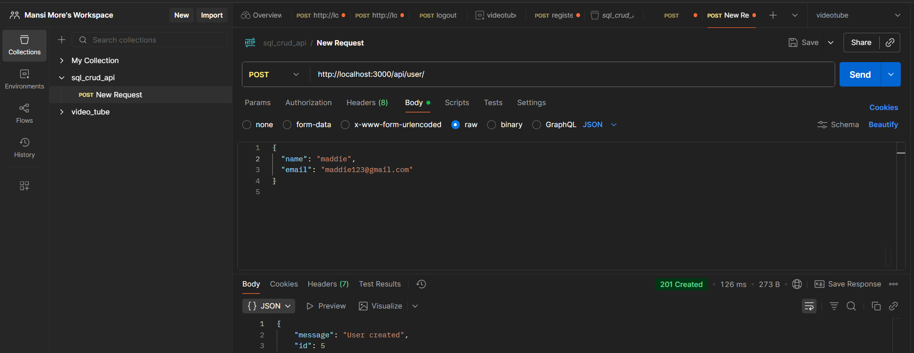
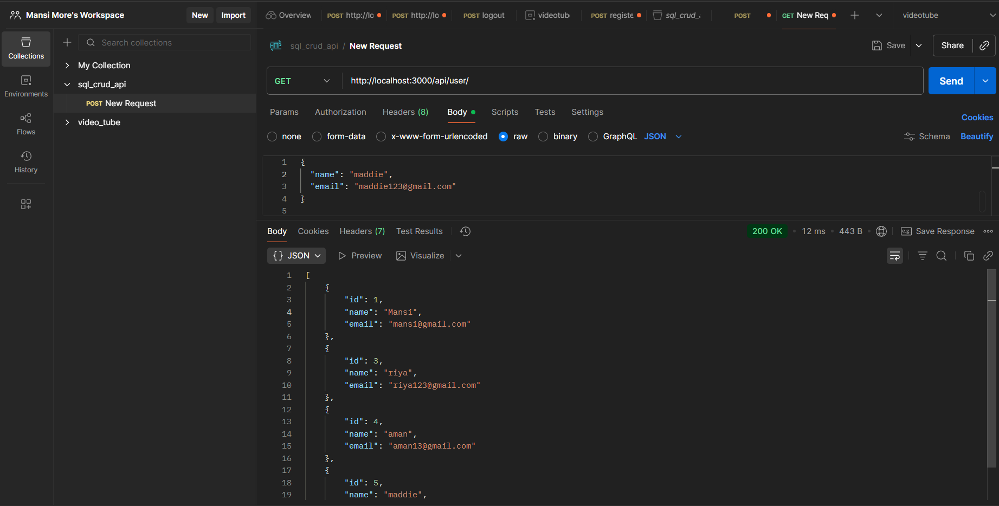
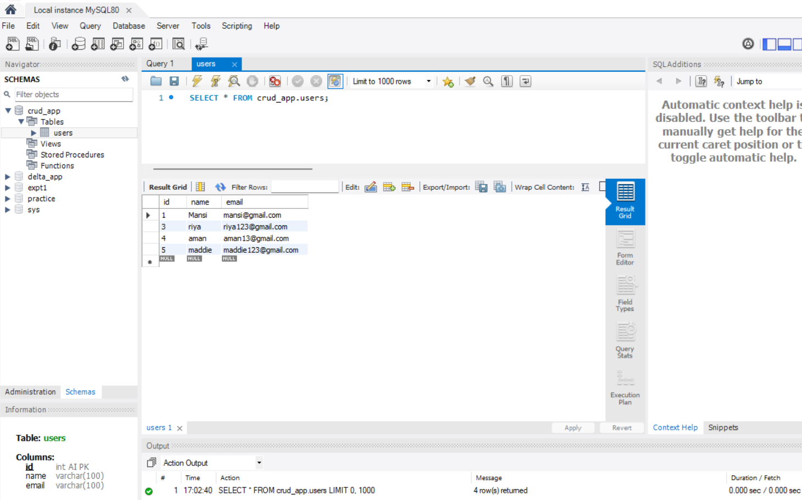

# Node.js MySQL CRUD API

A simple backend application demonstrating CRUD operations using Node.js, Express, and MySQL.
NOTE: APIs were tested using Postman and data was verified in MySQL Workbench.

## Features
- Create user
- Get all users
- Get user by ID
- Update user
- Delete user

## Tech Stack
- Node.js
- Express.js
- MySQL
- dotenv

## API Endpoints
POST /api/user  
GET /api/user  
GET /api/user/:id  
PUT /api/user/:id  
DELETE /api/user/:id  

## Screenshots(for quick reference)

### Create User (POST)

### Get Users (GET)

### MySQL Users Table

## Setup Instructions
1. Clone the repository
2. Run `npm install`
3. Create a `.env` file with DB credentials
4. Start server using `node index.js`
5. Test APIs using Postman

## Testing
APIs were tested using Postman and data was verified in MySQL Workbench.

----

## 📬 Connect With Me 

Built by <b>Mansi More</b> • moremansi1707@gmail.com

